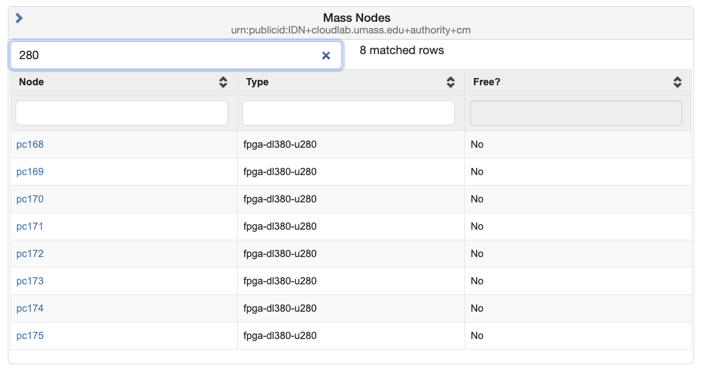
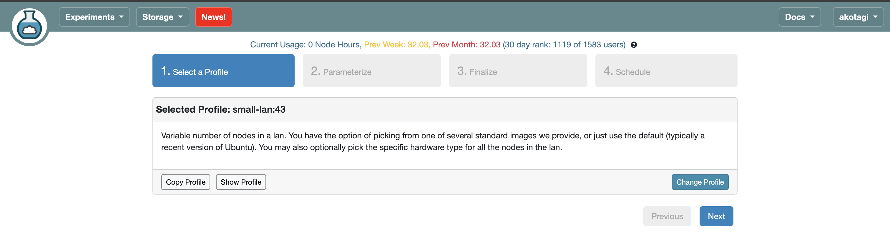
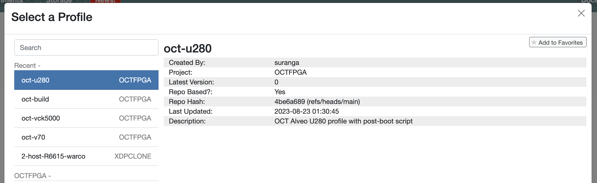
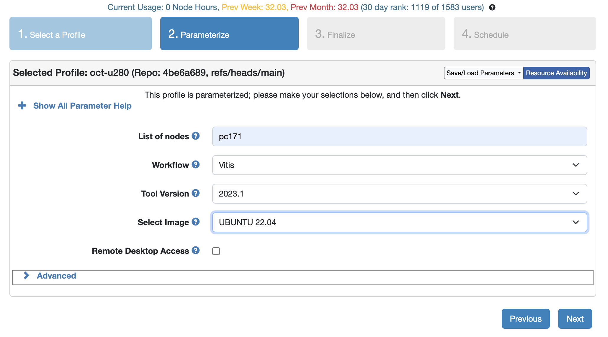
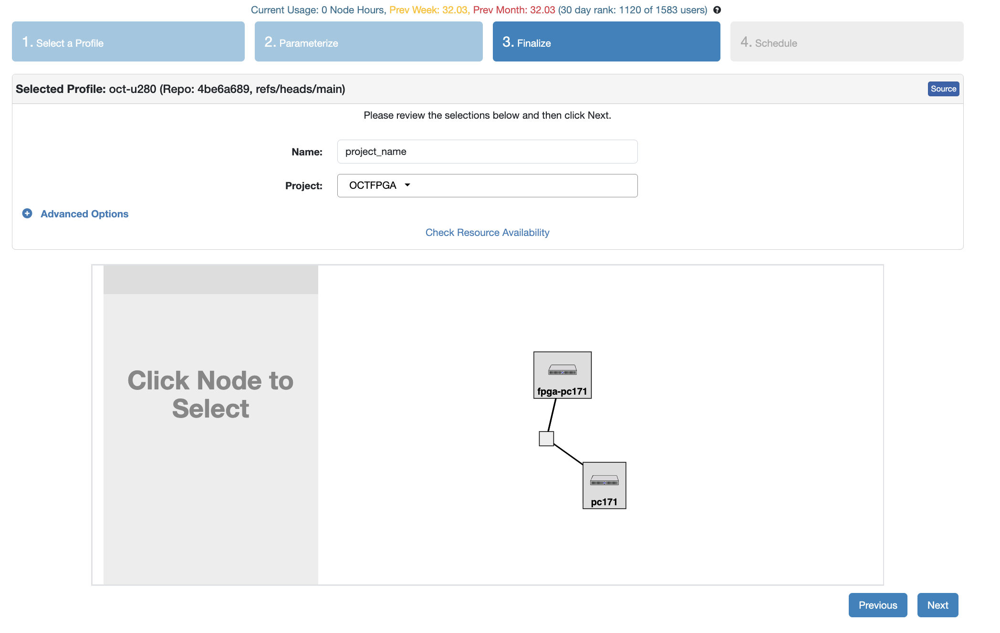
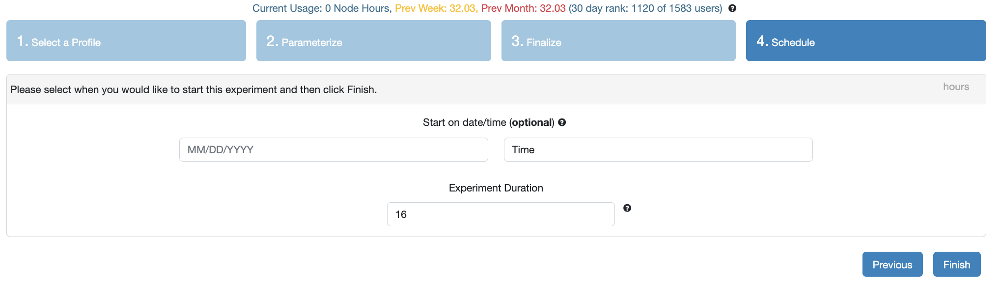

# Option A - Steps to reserve the U280 (Best option to run Full project)

Option A — OCT/Cloud node (simulation and FPGA): reserve a node with an Alveo board (e.g., U280), open a shell on the node, and use the preinstalled toolchain (Python/OpenCV for simulation; XRT/Vitis for emulation and on-board runs).

1) Follow the instructions at [https://github.com/OCT-FPGA/OCT-Tutorials/blob/master/cloudlab-setup/accounts.md] to get a cloud lab account.

2) Once the account has been setup, go to [https://www.cloudlab.us/instantiate.php] and login into your account with your credentials.

3) To Check the cluster status if the U280 node is free, go to Experiments -> Cluster Status -> sroll down until you find 'Mass Nodes' -> search for u280 -> check the 'Free?' column for 'Yes' and note down the corresponding node form the 'Node' column for reserving the node in next step. 



5) Go to Experiments -> Start Experiment -> Change Profile



6) Search and select 'U280'  -> click 'Select Profile' 



7) now fill in the contents -> click 'Next'
   a) List of nodes : In this type the Node name you checked from cluster status. Example. PC171
   b) Workflow: Vitis
   c) Tool Version: 2023.1
   d) Select Image: UBUNTU 22.04



8) Give project name -> select 'Next'



9) Click 'Finish'



10) Wait till you see a 

# Option B: Local PC terminal (This is only to run CPU part of the project, for the Hardware part please use Option A)

Option B — Local PC terminal (software-only): use a standard macOS or Ubuntu machine to run the Python/OpenCV pipeline and generate the golden outputs.

The following steps set up the tools needed to run the Python/OpenCV simulation on a macOS machine. If already setup can skip installation. 

1) Install Homebrew (if not already installed):
   
  ```/bin/bash -c "$(curl -fsSL https://raw.githubusercontent.com/Homebrew/install/HEAD/install.sh)"```
  
2) Add Homebrew to the PATH (Apple Silicon default path shown):

  ```echo 'eval "$(/opt/homebrew/bin/brew shellenv)"' >> ~/.zprofile```

  ```eval "$(/opt/homebrew/bin/brew shellenv)"```

3) Install Python:

  ```brew install python```

4) Install utilities::

  ```brew install wget```

  ```brew install ffmpeg```

5) Install Python packages:

  ```pip3 install --upgrade pip```

  ```pip3 install numpy opencv-python```
