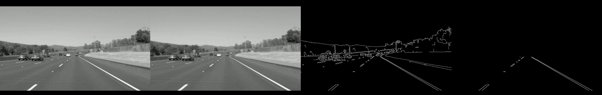
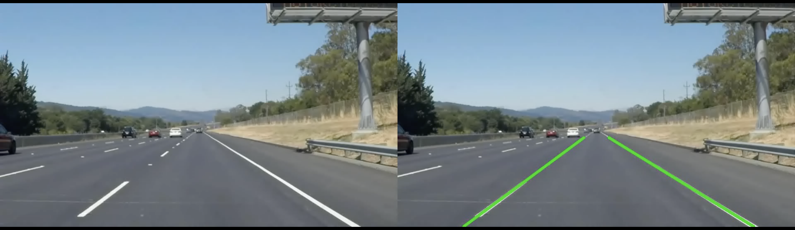

# Introduction
This project builds a real-time lane and road-edge detection system with FPGA acceleration. The aim is to detect lane markings and road boundaries from dashcam video quickly and reliably, with a path toward use in driver-assistance and autonomous systems. The workflow starts in software and then moves the compute-heavy parts—primarily edge detection—to hardware using Vitis HLS on an AMD Alveo U280.

The first phase is a software-only baseline written in Python and OpenCV. This version is used to prove that the lane-detection logic is correct before touching hardware. The pipeline applies a trapezoidal region of interest, a light Gaussian blur, Canny edge detection, and Hough-based line finding, followed by simple left/right averaging to keep the lanes stable. The outputs include diagnostic images and videos that clearly show the detected lanes over the original footage.

After the CPU version is solid, the edge-detection stage is moved onto the FPGA. That block is rewritten in C/C++ for Vitis HLS and synthesized for the U280 so the hardware can handle the fast pixel work. The target is straightforward: lower latency and higher frames per second. Post-processing—such as lane averaging and drawing the overlays—stays on the CPU to keep iteration quick and the overall flow balanced.

The design is intentionally modular. The host manages I/O, light preprocessing, and visualization, while the FPGA accelerates the heavy computation. This split makes development simple on a single machine today and leaves room to scale to a larger or cloud setup later without rewriting the entire pipeline.

By the end of the project, the full flow demonstrates how FPGA acceleration can speed up a vision workload without sacrificing correctness. Deliverables include the CPU “golden” results, side-by-side comparisons of original and processed video, a four-panel clip showing each stage of the pipeline, and an FPGA-accelerated run that highlights the performance gains.

# Step0 - Environment Bring-Up

Open [https://github.com/akotagi23/FPGA-Lane-Edge-Detection-V70/blob/main/Project_Setup.md] to setup and start the experiment. Note: Option B commands can also be used if stuck during any later steps in the project specfically during the software execution.  

# Software CPU Execution.

# Step1 - To download this project onto any system, run the following command in the terminal:

```git clone https://github.com/akotagi23/FPGA-Lane-Edge-Detection-V70.git```

Once cloned, move into the project directory:

```cd FPGA-Lane-Edge-Detection-V70```

# Step2 - Download Sample Dashcam Video

```cd data```

```wget -O white.mp4 https://raw.githubusercontent.com/udacity/CarND-LaneLines-P1/master/test_videos/solidWhiteRight.mp4```

you should be able to see white.mp4 video inside the data folder

```cd ..```


# Step3 - Run the python codes

```cd FPGA-Lane-Edge-Detection-V70```

```python3 src/video_to_edge.py --video data/white.mp4 --out out/video_to_edge.mp4```

```python3 src/edge_to_lane.py --video data/white.mp4 --out out/video_to_lane.mp4```

# Step4 - Verify the output in the "out" directory:

run this command to execute the output 

```open video_to_edge.mp4```



This four-part visualization helps understand each step in the processing sequence:

First Panel (Original Frame)
Displays the raw grayscale frame from the input dashcam video (white.mp4). This is the starting point before any filtering or edge detection is applied.

Second Panel (Blurred Frame)
A Gaussian blur (3×3 kernel) is applied to reduce noise and smooth small variations in the image, which helps in preventing false edge detection.

Third Panel (Canny Edge Detection)
The Canny edge detector identifies sharp intensity changes, highlighting lane markings, guard rails, and other high-contrast regions in white.
This step forms the foundation for later line detection.

Fourth Panel (ROI-Masked Edges)
The Region of Interest (ROI) mask limits the visible edges to the part of the frame where lanes are expected. This trapezoidal area reduces computational load and removes irrelevant edges such as the sky or roadside trees.


```video_to_lane.mp4```



This visualization is divided into two panels:

Left Panel – Original Frame
Displays the original dashcam frame from the input video (white.mp4).
This frame serves as the baseline reference before applying any detection or overlay.

Right Panel – Lane Overlay
Shows the same frame after processing through the pipeline.
The detected lane boundaries are highlighted in green, obtained using the Hough Line Transform.
These lines represent the estimated left and right lane edges based on the detected road markings within the defined Region of Interest (ROI).

# Hardware FPGA Execution

# Step1 - To download this project onto any system, run the following command in the terminal:

```git clone https://github.com/akotagi23/FPGA-Lane-Edge-Detection-V70.git```

Once cloned, move into the project directory:

```cd FPGA-Lane-Edge-Detection-V70```

# Step2 - Download Sample Dashcam Video

```cd data```

```wget -O white.mp4 https://raw.githubusercontent.com/udacity/CarND-LaneLines-P1/master/test_videos/solidWhiteRight.mp4```

you should be able to see white.mp4 video inside the data folder

```cd ..```

# Step3 - Generate the HLS kernel object (.xo)

```cd FPGA-Lane-Edge-Detection-V70/hls/edge_detection```

```vitis_hls -f script.tcl```

You should be able to see "edge_detect.xo" file 

# Step4 - Build host application

```cd FPGA-Lane-Edge-Detection-V70/host```

```sudo apt update```

```sudo apt install pkg-config```

```sudo apt install libopencv-dev```

```make```

You should be able to see a executable file named "host"

# Step5 - Build XCLBIN file

```cd ~/FPGA-Lane-Edge-Detection-V70/hls/edge_detection```

```bash
v++ -l \
  --kernel edge_detect \
  --platform xilinx_u280_gen3x16_xdma_1_202211_1 \
  --connectivity.nk edge_detect:1:edge_detect_1 \
  --connectivity.sp edge_detect_1.in_img:DDR[0] \
  --connectivity.sp edge_detect_1.out_img:DDR[1] \
  edge_detect.xo \
  -o edge_detect.xclbin
```

you should have the file name as "edge_detect.xclbin"

# Step6 - Copy the edge_detect.xclbin to host folder. 

```cp edge_detect.xclbin ../../host/
```

# Step6 - Running the full pipeline on FPGA

```cd FPGA-Lane-Edge-Detection-V70/host```

```./host edge_detect.xclbin ../data/white.mp4```

you should get "out_edge.mp4" in data folder. 


