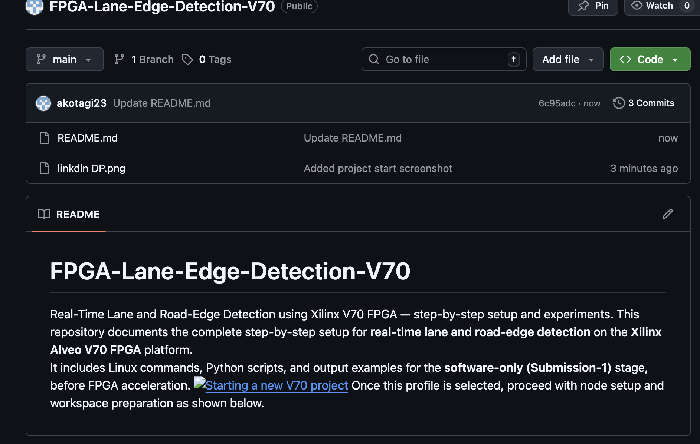

# FPGA-Lane-Edge-Detection-V70
Real-Time Lane and Road-Edge Detection using Xilinx V70 FPGA — step-by-step setup and experiments.
This repository documents the complete step-by-step setup for **real-time lane and road-edge detection** on the **Xilinx Alveo V70 FPGA** platform.  
It includes Linux commands, Python scripts, and output examples for the **software-only (Submission-1)** stage, before FPGA acceleration.

Once this profile is selected, proceed with node setup and workspace preparation as shown below.

