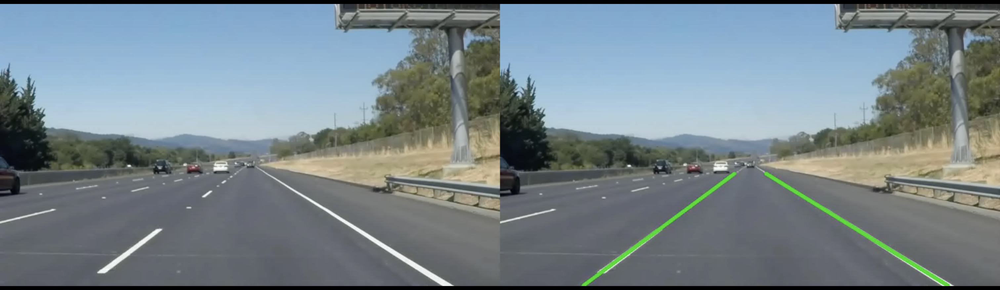

# Introduction
This document explains how to reproduce the software-only (“golden”) pipeline for lane and road-edge detection using Python and OpenCV. It describes the environment requirements (Python version, packages, and FFmpeg), the expected repository layout, and how dashcam video is prepared as input (either as an MP4 file or as frames extracted at a fixed frame rate). It then outlines the sequence of scripts that implement the reference pipeline—region-of-interest selection, Gaussian smoothing, Canny edge detection, Hough line fitting, and lane averaging—and how each script produces artifacts used for verification. Generated outputs include per-frame diagnostics, a four-panel stage visualization, edges-only clips, side-by-side comparisons, and a lane-overlay video that serves as the golden reference for later hardware work.

# Step1 - Environment Bring-Up

Option A — OCT/Cloud node (simulation and FPGA): reserve a node with an Alveo board (e.g., U280), open a shell on the node, and use the preinstalled toolchain (Python/OpenCV for simulation; XRT/Vitis for emulation and on-board runs).

Option B — Local PC terminal (software-only): use a standard macOS or Ubuntu machine to run the Python/OpenCV pipeline and generate the golden outputs.

The following steps set up the tools needed to run the Python/OpenCV simulation on a macOS machine. If already setup can skip installation. 

1) Install Homebrew (if not already installed):
   
  ```/bin/bash -c "$(curl -fsSL https://raw.githubusercontent.com/Homebrew/install/HEAD/install.sh)"```
  
2) Add Homebrew to the PATH (Apple Silicon default path shown):

  ```echo 'eval "$(/opt/homebrew/bin/brew shellenv)"' >> ~/.zprofile```

  ```eval "$(/opt/homebrew/bin/brew shellenv)"```

3) Install Python:

  ```brew install python```

4) Install utilities::

  ```brew install wget```

  ```brew install ffmpeg```

5) Install Python packages:

  ```pip3 install --upgrade pip```

  ```pip3 install numpy opencv-python```

# Step2 - To download this project onto any system, run the following command in the terminal:

```git clone https://github.com/akotagi23/FPGA-Lane-Edge-Detection-V70.git```

Once cloned, move into the project directory:

```cd FPGA-Lane-Edge-Detection-V70```

# Step3 - Download Sample Dashcam Video

```cd data```

```wget -O white.mp4 https://raw.githubusercontent.com/udacity/CarND-LaneLines-P1/master/test_videos/solidWhiteRight.mp4```

you should be able to see white.mp4 video inside the data folder

```cd ..```


# Step4 - Run the python codes

```cd FPGA-Lane-Edge-Detection-V70```

```python3 src/video_to_edge.py --video data/white.mp4 --out out/video_to_edge.mp4```

```python3 src/edge_to_lane.py --video data/white.mp4 --out out/video_to_lane.mp4```

# Step5 - Verify the output in the "out" directory:

run this command to execute the output 

```open video_to_edge.mp4```


This four-part visualization helps understand each step in the processing sequence:

First Panel (Original Frame)
Displays the raw grayscale frame from the input dashcam video (white.mp4). This is the starting point before any filtering or edge detection is applied.

Second Panel (Blurred Frame)
A Gaussian blur (3×3 kernel) is applied to reduce noise and smooth small variations in the image, which helps in preventing false edge detection.

Third Panel (Canny Edge Detection)
The Canny edge detector identifies sharp intensity changes, highlighting lane markings, guard rails, and other high-contrast regions in white.
This step forms the foundation for later line detection.

Fourth Panel (ROI-Masked Edges)
The Region of Interest (ROI) mask limits the visible edges to the part of the frame where lanes are expected. This trapezoidal area reduces computational load and removes irrelevant edges such as the sky or roadside trees.


```video_to_lane.mp4```



This visualization is divided into two panels:

Left Panel – Original Frame
Displays the original dashcam frame from the input video (white.mp4).
This frame serves as the baseline reference before applying any detection or overlay.

Right Panel – Lane Overlay
Shows the same frame after processing through the pipeline.
The detected lane boundaries are highlighted in green, obtained using the Hough Line Transform.
These lines represent the estimated left and right lane edges based on the detected road markings within the defined Region of Interest (ROI).


